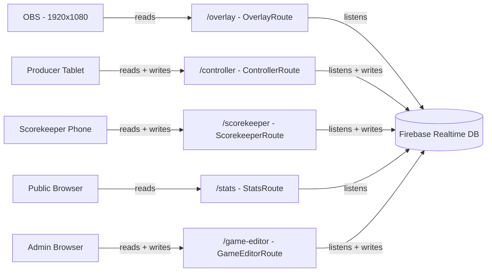
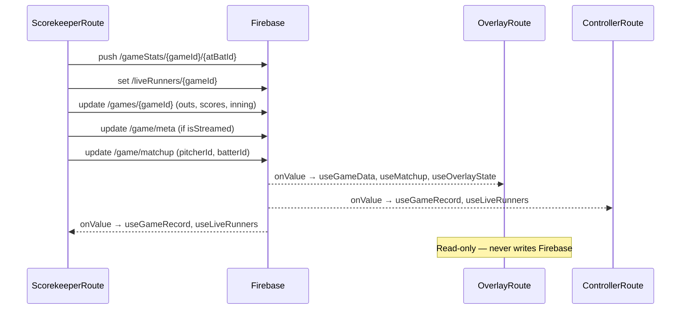
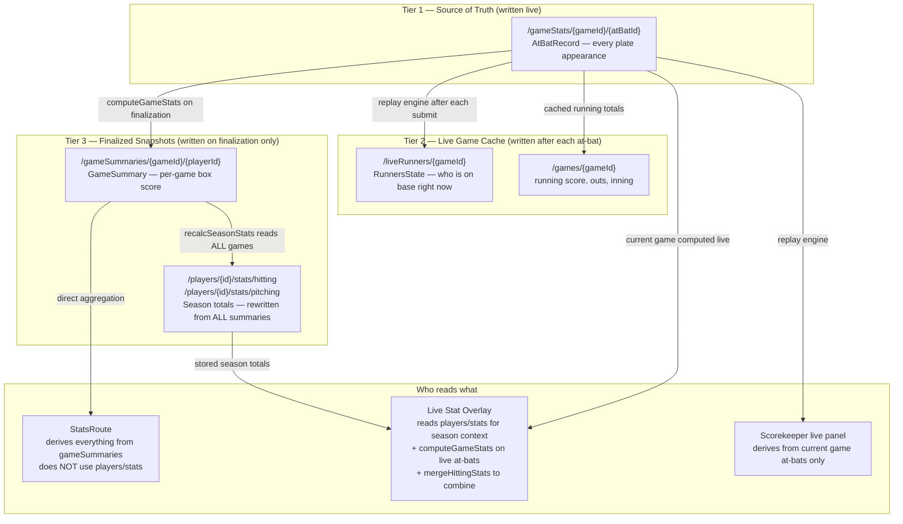
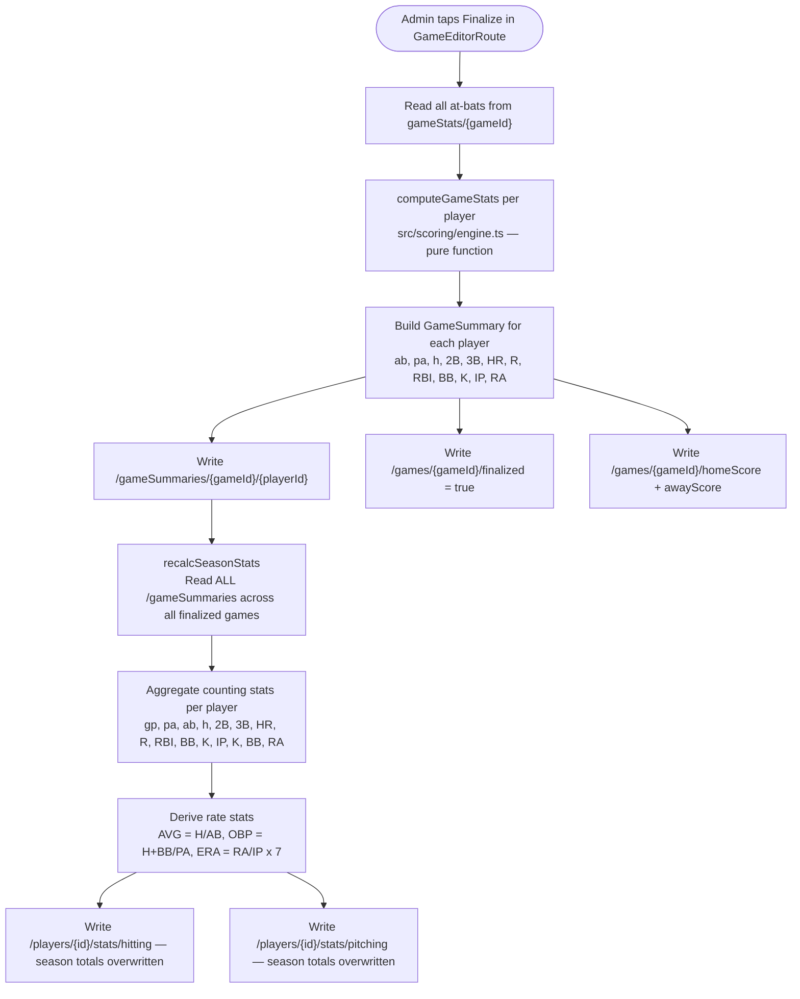
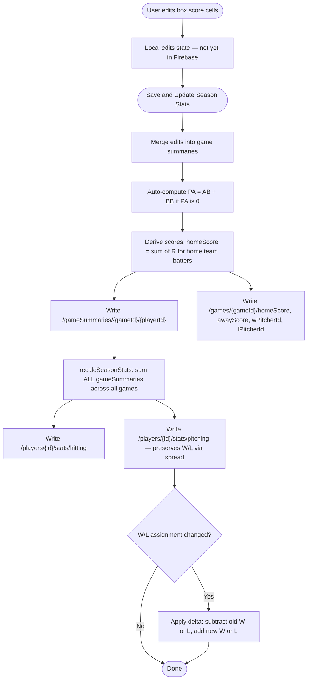
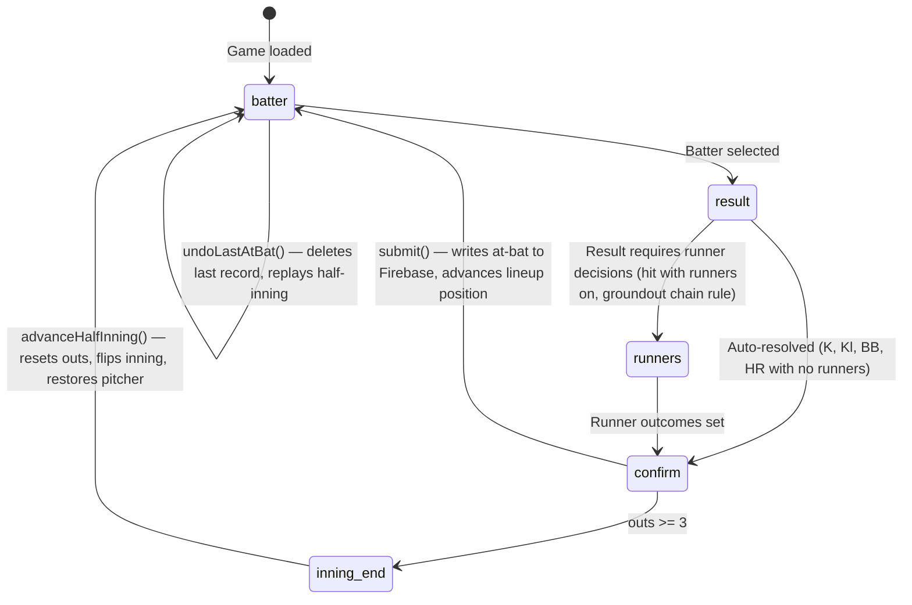
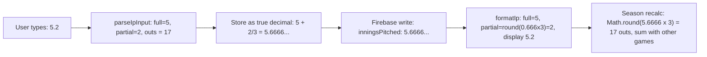
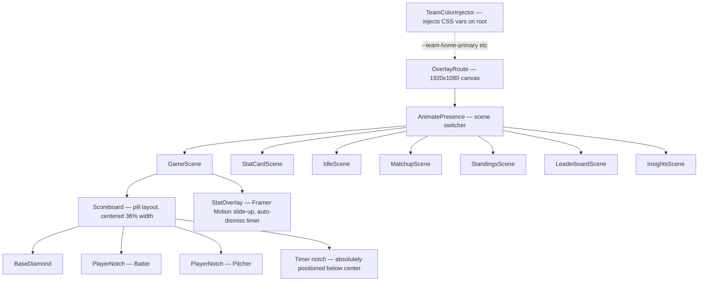

# Wiffle Ball Overlay — Architecture Diagrams

> Open this file in VS Code (`Ctrl+Shift+V`) with the Mermaid Preview extension to see rendered diagrams.
> Text reference: see `ARCHITECTURE.md` in the project root.

---

## 1. System Overview — Routes & Devices

---

## 2. Live Game Data Flow

---

## 3. Firebase Schema Tree

```mermaid
graph TD
    ROOT[Firebase Root]

    ROOT --> CONFIG["/config"]
    CONFIG --> LOGO["leagueLogo: string"]

    ROOT --> GAME["/game"]
    GAME --> META["meta - GameMeta: scores, inning, outs, bases, teamIds"]
    GAME --> MATCHUP["matchup - MatchupState: batterId, pitcherId, lastPitcher x2"]

    ROOT --> TEAMS["/teams/{teamId}"]
    TEAMS --> TEAM_FIELDS["name, shortName, primaryColor, secondaryColor, logoUrl"]

    ROOT --> PLAYERS["/players/{playerId}"]
    PLAYERS --> P_BASE["name, teamId, jerseyNumber"]
    PLAYERS --> P_STATS["stats/"]
    P_STATS --> HITTING["hitting - HittingStats: gp pa ab h 2B 3B HR R RBI BB K AVG OBP SLG OPS"]
    P_STATS --> PITCHING["pitching - PitchingStats: gp IP K BB RA ERA W L"]

    ROOT --> OVERLAY["/overlay - OverlayState"]
    OVERLAY --> SCENE["activeScene"]
    OVERLAY --> STATOV["statOverlay: visible, type, playerId, dismissAfterMs"]
    OVERLAY --> TIMER["timer: durationMs, startedAt, running"]
    OVERLAY --> HOMERUN["homerun: active, teamSide, playerId, runsScored"]

    ROOT --> GAMES["/games/{gameId} - GameRecord"]
    GAMES --> G_META["homeTeamId, awayTeamId, date, finalized, isStreamed, startedAt"]
    GAMES --> G_SCORES["homeScore, awayScore, wPitcherId, lPitcherId"]
    GAMES --> G_STATE["inning, isTopInning, outs"]
    GAMES --> LINEUPS["lineups/{teamId} - LineupEntry[]"]
    GAMES --> LINEUP_POS["lineupPosition/{teamId} - int"]

    ROOT --> GAMESTATS["/gameStats/{gameId}/{atBatId} - AtBatRecord"]
    GAMESTATS --> AB_FIELDS["batterId, pitcherId, isSub, inning, isTopInning, timestamp, result, outsOnPlay, rbiCount, batterAdvancedTo, runnersScored[]"]
    GAMESTATS --> AB_RUNNERS["runnersOnBase - snapshot before play; runnerOutcomes - what happened to each runner"]

    ROOT --> LIVERUNNERS["/liveRunners/{gameId} - RunnersState: first, second, third"]

    ROOT --> SUMMARIES["/gameSummaries/{gameId}/{playerId} - GameSummary"]
    SUMMARIES --> SUM_HIT["ab, pa, h, 2B, 3B, HR, R, RBI, BB, K"]
    SUMMARIES --> SUM_PITCH["inningsPitched, pitchingK, pitchingBb, runsAllowed"]
```

---

## 4. Data Tier Architecture — What Is Stored vs Derived

This answers: where does data flow, what gets written vs computed, and where do season stats come from.

**Key facts:**
- `/players/{id}/stats` is a **write-through cache** — always recomputed from all `gameSummaries` at finalization time. Never manually edited.
- `StatsRoute` ignores `/players/{id}/stats` entirely and re-derives from `gameSummaries` on every load.
- The live overlay is the only consumer that uses stored season stats — it needs them without fetching every game's raw at-bats.
- A player's season stats are only as current as the last finalization. Mid-season live games only appear in the overlay's stat card (via merge), not in the stats page until finalized.

---

## 5. Game Finalization Flow

Finalization runs entirely client-side in `GameEditorRoute`. It is a multi-path Firebase `update()` call — all writes happen atomically in one batch.

**Note on architecture:** All this logic runs in the browser. For an internal tool this is acceptable, but the risk is a partial write if the tab closes mid-finalization. A Firebase Cloud Function would eliminate that risk and keep the logic off the client. Not urgent, but worth noting for future.

---

## 6. Game Editor — Save Flow

---

## 7. Scorekeeper At-Bat Wizard

---

## 8. Innings Pitched Round-Trip

---

## 9. Component Relationships (Overlay)

